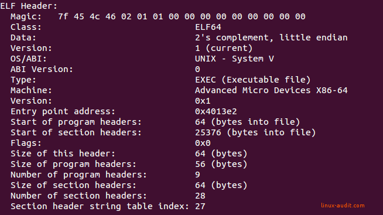

# What is an elf?

elf -> Executable and Linkable Format,
elf -> program compiled

# ELF anatomy

#### Structure
It's compose by two elements
* ELF Header
* File Data

#### Header
* With readelf, we get the struct of the file

1. Elf start with magic number: 7f(prefix) 45=E 4c=L 46=F
2. Class, defines the architectures of the file:
   * 32bits -> (01)
   * 64bits -> (02)
3. Data: data field:
   * 01 -> LSB -> Less Significant Bit -> little-endian
   * 02 -> MSB -> Most Significant Bit -> big-endian
4. Version: always the same -> 01
5. OS/ABI:
   * Each system has a big overlap in common functions, but also
     at least minor differences. The definition of the right set is done
     in Application Binary Interface.
   * In this field the binary explain what it will be compatible with.
6. Machine: expected machine type
7. Type: tell us what the purpose of the file is:
   * CORE -> 4
   * DYN  -> Shared object file, for libraries -> 3
   * EXEC -> Executable file, for binaries -> 2
   * REL  -> Relocatable file, before linked into an EXEC -> 1

# File data
Besides the ELF header:
* Program Headers or Segments (9)
  that are used for the linker to allow execution
* Section Headers or Sections (29)
  categorizing instruction and data
* Data

## Program header
Elf file consist of zero of more segments, and describe how to create
a precess / memory for runtime execution.
When the kernel sees these segments, it uses them to map them into virtual
address space. (mmap)
It convert predefined instruction into memory image.
It use segment to form process.

#### GNU_EH_FRAME
Here is sorted queue used by gcc, It stores exception handlers.
If something goes wrong, It can use this area to deal with it.

#### GNU_STACK
Here are stock the stack.
stack is not executable, because if somebody put in it
corrupted code, By manipulation of memory,
one could refer to this executable stack and run intended instructions.

## Elf sections

### section headers
The section headers define all the sections in the files. As said,
this view is used for linking and relocation.

for executable file, there are four main section:
.text, .data, .rodata, .bss
Each of these section is loaded with different access rights
`readelf -S`

.text  
Contains executable code, It will be packed into segment with read and  
execute access rights. It's only load once, as the content will not change.  
this can be seen with the objdump utility.

.data
initialized data, read / write access

.rodata
initialized data, only read

.bss
uninitialized data, read / write access

# Static vs Dynamic binaries
There are 2 types of binaries: static or dynamic,
it's depends on the lib that they used.
* For optimisation purpose, we often see dynamic binaries.
  theses binaries need external content to run correctly.
use `lld` or `file` to see the external links.

# les sections
objdump -M intel -d

.fini: execute le code de cette section quand le programme quitte normalement

.init: est executer avant de lance le main

# how parse the elf ?

# get some

elf parser in python
https://www.youtube.com/watch?v=5RK7sYTOeNk

on commence par compipler un simple hello word,
avec les 2 commands :
* fno-PIE
  - https://access.redhat.com/blogs/766093/posts/1975793
  - Position Independent Executable, security feature,
  when the kernel loads the binary and dependency into random
  location each time it's run
* static
  - ?

on check si le binaire est bien no PIE avec `checkset` apt

je `strip` le binaire pour elever des metha data
check avec `ls -la`

si on regarde les sections du binaires, il est possible d'executer
des choses dans la section .rodata, alors qu'elle est est en lecture
seul, car si le padding n'est pas assez important, et que la taille
des pages est de 4000, la section se croite avec une autre qui
est executable!

ok, je mets du temps a faire la vm, mais c'est bon tout marche :).

j'ouvre avec l'ide ida, et on commence avec l'EP, entry point,
qui est le start (401C10), si on parle de packer, ca devient
le original entry point. OEP.

